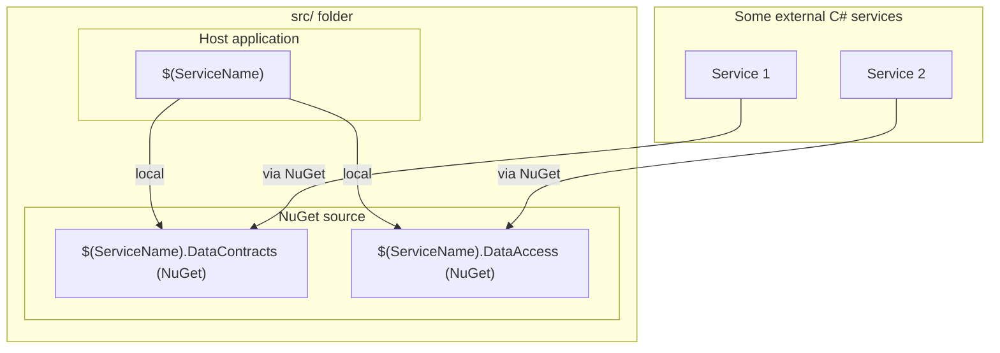

# $(ServiceName) Microservice

This repository offers a foundational C# microservice template designed to streamline the development of scalable and efficient microservices. It provides a structured framework that adheres to best practices, facilitating rapid deployment and maintainability.

## **Key Features:**

•	_Modular Architecture_. 
    
    Promotes separation of concerns, ensuring each component is independently testable and deployable.

•	_RESTful API Implementation_.

    Includes a basic setup for RESTful APIs, enabling seamless client-service communication.

•	_Data Access Layer_.

    Incorporates a data access layer using Entity Framework Core, supporting various database providers.

•	_Dependency Injection_.
    
    Utilizes built-in .NET Core dependency injection for better code manageability and testing.

•	_Docker Support_.
    
    Comes with a Dockerfile to facilitate containerization, ensuring consistent environments across development, testing, and production.

## **Visualization Structure**

Here’s a diagram illustrating the structure of this repository:



## **Getting Started:**
	
1.	Install the template
```sh
dotnet new --install <path-to-template>
```

2.	Create a new project from template
```sh
dotnet new microservice -n $(ServiceName) --root-namespace $(RootNamespace)
```

3.	Navigate to the Project Directory
 ```sh
 cd $(ServiceName)
```

4.	Build the Solution

```sh
dotnet build

```

5.	Run the Application

```sh
cd src/Host
dotnet run
```


## **Contributing:**

Contributions are welcome! Please fork the repository and create a pull request with your enhancements or bug fixes.

## **License:**

This project is licensed under the **MIT** License.


This structure provides a clean abstraction across different components of the project.

For a practical example of how to use this template, check out the "example-usage" branch.

## Tips
**Be sure** to update the root namespace to match your project's structure. You can use the appropriate rename-script.* file for your system to handle this update.
