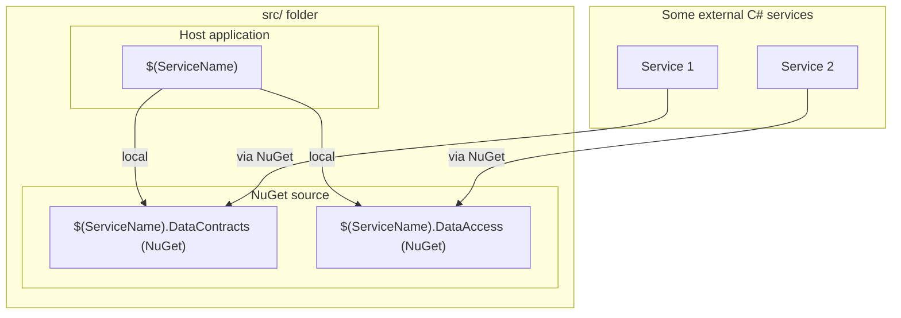

# $(ServiceName) Microservice

This repository offers a foundational C# microservice template designed to streamline the development of scalable and efficient microservices. It provides a structured framework that adheres to best practices, facilitating rapid deployment and maintainability.

## **Key Features:**

• **Modular Architecture**
    
    Promotes separation of concerns, ensuring each component is independently testable and deployable.

• **RESTful API Implementation**

    Includes a basic setup for RESTful APIs with base controller interfaces, enabling seamless client-service communication.

• **Data Access Layer**

    Incorporates a data access layer using Entity Framework Core with PostgreSQL support, including base repository patterns and filtering capabilities.

• **Dependency Injection**
    
    Utilizes built-in .NET Core dependency injection for better code manageability and testing.

• **Validation Support**

    Includes data validation attributes and base DTO/Entity classes with validation examples.

• **Swagger/OpenAPI Integration**

    Built-in Swagger support with configurable endpoint prefixes for API documentation.

• **Logging**

    Integrated Serilog logging with environment-based configuration and request logging.

• **Error Handling**

    Custom problem details factory for consistent error responses across the API.

• **Docker Support**
    
    Comes with a Dockerfile to facilitate containerization, ensuring consistent environments across development, testing, and production.

## **Visualization Structure**

Here’s a diagram illustrating the structure of this repository:



## **Getting Started:**

1. **Install the template**
```sh
dotnet new --install <path-to-template>
```

2. **Create a new project from template**
```sh
dotnet new microservice -n $(ServiceName) --root-namespace $(RootNamespace)
```

3. **Navigate to the Project Directory**
```sh
cd $(ServiceName)
```

4. **Configure the application**

   Update `src/Host/appsettings.json` or `appsettings.Development.json` with your database connection settings:
   ```json
   {
     "BaseConfiguration": {
       "DatabaseConfig": {
         "DbUserName": "your_username",
         "DbPassword": "your_password",
         "DbConnection": "Host=localhost;Database=your_database"
       },
       "SwaggerConfig": {
         "IsEnabled": true,
         "EndpointPrefix": ""
       }
     }
   }
   ```

   For production, use environment variables:
   ```sh
   BaseConfiguration__DatabaseConfig__DbUserName=your_username
   BaseConfiguration__DatabaseConfig__DbPassword=your_password
   BaseConfiguration__DatabaseConfig__DbConnection=Host=localhost;Database=your_database
   ```

5. **Build the Solution**
```sh
dotnet build
```

6. **Run the Application**
```sh
cd src/Host
dotnet run
```

7. **Access Swagger UI** (if enabled)

   Navigate to `http://localhost:5000/swagger` or `http://localhost:5000/{EndpointPrefix}/swagger` if a prefix is configured.


## **Contributing:**

Contributions are welcome! Please fork the repository and create a pull request with your enhancements or bug fixes.

## **License:**

This project is licensed under the **MIT** License.


## **Project Structure**

This structure provides a clean abstraction across different components of the project:

- **Host**: Main application entry point with controllers, services, and configuration
- **DataAccess**: Data access layer with Entity Framework Core, repositories, and database context
- **DataContracts**: DTOs and service interfaces for business logic layer

## **Additional Resources**

- For database migrations, see `src/ServiceTemplate.DataAccess/Readme.md`
- For a practical example of how to use this template, check out the "example-usage" branch

## **Tips**

- **Namespace**: Be sure to update the root namespace to match your project's structure. You can use the appropriate rename-script.* file for your system to handle this update.
- **Environment Variables**: Use environment variables for sensitive configuration in production environments.
- **Validation**: Inherit from base `Dto` and `Entity` classes to leverage built-in validation attributes.
- **Logging**: Sensitive data logging is automatically disabled in non-Development environments for security.
