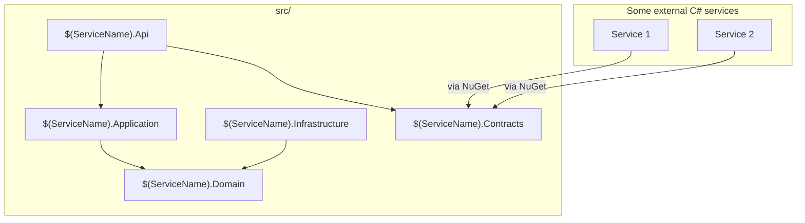

# $(ServiceName) microservice template

This repository provides a production-oriented C# microservice template based on Clean Architecture and a clear separation of responsibilities.

## Key features

- **Clean architecture**: `Api` (composition root), `Application` (use-cases), `Domain` (core model), `Infrastructure` (EF Core + integrations), `Contracts` (public DTOs).
- **Swagger/OpenAPI**: enabled by default in Development/Staging.
- **Health checks**: `/health/live` and `/health/ready`.
- **Observability**: OpenTelemetry logs/traces via OTLP, metrics via Prometheus scrape (`/metrics`).
- **Docker**: local `docker-compose` for API + Postgres and optional observability stack.

## Structure

Here’s a simplified diagram of the dependency direction:


```mermaid
graph TD;
    
    subgraph Src_Folder ["src/"]
        Api["$(ServiceName).Api"]
        Application["$(ServiceName).Application"]
        Domain["$(ServiceName).Domain"]
        Infrastructure["$(ServiceName).Infrastructure"]
        Contracts["$(ServiceName).Contracts"]
    end

    Api --> Application
    Application --> Domain
    Infrastructure --> Domain
    Api --> Contracts
    
    subgraph Other_Services ["Some external C# services"]
        OtherService1["Service 1"]
        OtherService2["Service 2"]
    end
    
    OtherService1 -->|via NuGet| Contracts
    OtherService2 -->|via NuGet| Contracts
```

## Getting started

1. **Install the template**
```sh
dotnet new install .
```

2. **Create a new project from template**
```sh
dotnet new microservice -n $(ServiceName) --root-namespace $(RootNamespace)
```

3. **Navigate to the Project Directory**
```sh
cd $(ServiceName)
```

4. **Build the solution**
```sh
dotnet build
```

5. **Run the API**
```sh
dotnet run --project src/$(ServiceName).Api
```

6. **Run locally with Docker (API + Postgres)**

```sh
docker compose -f deploy/docker-compose.yml up --build
```

7. **Access Swagger UI** (Development/Staging)

   Navigate to `http://localhost:8080/swagger`.

## Observability (local)

- **Traces and logs**: exported via **OTLP** to the local stack (see `deploy/docker-compose.observability.yml`).
- **Metrics**: exposed at **`/metrics`** and scraped by **Prometheus** (local stack).

The observability compose uses `:latest` images on purpose for local development convenience. If you want reproducible environments, pin explicit versions in `deploy/docker-compose.observability.yml`.


## Contributing

Contributions are welcome! Please fork the repository and create a pull request with your enhancements or bug fixes.

## License

This project is licensed under the **MIT** License.
